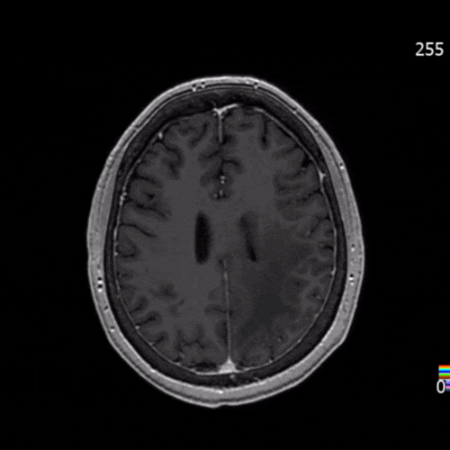

U-Net for Brain MRI Segmentation
================================

This project demonstrates the use of a U-Net model in PyTorch for the segmentation of abnormalities in brain MRI scans, particularly FLAIR abnormalities. The U-Net architecture is widely used in medical imaging tasks due to its ability to achieve high segmentation accuracy.

The method used here is inspired by various deep learning techniques for biomedical image segmentation, including the work presented in the paper [Automated Brain Tumor Segmentation Using Deep Learning Techniques](https://www.mdpi.com/2075-4418/13/9/1562).

Dataset
-------

The dataset used for this project is from the [BraTS 2020 dataset](https://www.med.upenn.edu/cbica/brats2020/data.html), which provides multi-institutional MRI scans, specifically glioblastoma and lower-grade gliomas. The dataset includes pre-processed MRI scans (in NIfTI format) with expert annotations.

Docker Setup
------------

To simplify the setup process, we provide a Docker environment that includes all necessary dependencies:

docker build -t brainseg .
docker run --rm --shm-size 8G -it -v \`pwd\`:/workspace brainseg

Training the Model
------------------

To train the model, run the following command after setting up your environment:

python3 train.py --images ./data --batch-size 16 --epochs 50 --lr 0.0001 --weights ./weights/unet.pt

This command will train the U-Net model on the MRI dataset and save the trained weights in the `./weights` directory. You can adjust hyperparameters such as batch size, learning rate, and epochs by modifying the appropriate flags.

Inference
---------

Once training is complete or if you are using the pretrained weights, you can run inference on new MRI images:

python3 inference.py --weights ./weights/unet.pt --images ./data --output ./predictions

This command will process the input images and output the predicted segmentations.

Model
-----

The U-Net architecture used in this project is a convolutional neural network designed for biomedical image segmentation. This variant includes batch normalization for improved training stability.

TensorRT Optimization
---------------------

If you're looking to optimize inference performance using Nvidia TensorRT, refer to the official Nvidia blog post: [Speed Up Inference with TensorRT](https://developer.nvidia.com/blog/speed-up-inference-tensorrt/).

